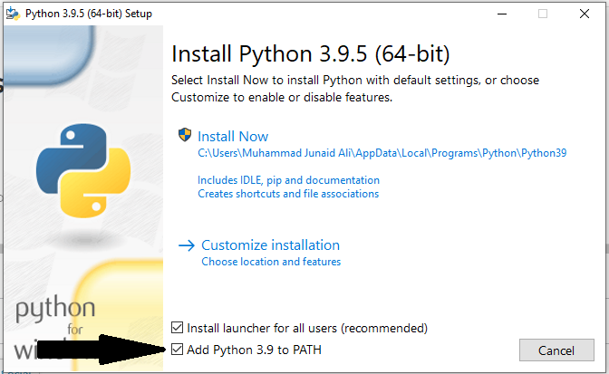

# Prueba Técnica Magister

### Prueba Técnica para [Magister](https://web.magister.com/) por [@JuanManiglia](https://github.com/juanmaniglia)

### Tabla de contenidos

- [Descripción](#descripción)
- [Herramientas Utilizadas](#herramientas-utilizadas)
- [Estructura de Carpetas](#estructura-de-carpetas)
- [Pasos del Proyecto](#pasos-de-proyecto)
- [Hardware](#hardware)
- [Instrucciones](#instrucciones)

---
## Descripción

La siguiente investigación es sobre un conjunto de datos del Titanic suministrado por Magister.

Esta prueba consiste en analizar los datos y extraer información valiosa de ellos y reponder unas hipótesis planteadas.

El objetivo es aplicar algunas técnicas de limpieza de datos para crear una estructura de datos accesible para el equipo de Data Science, para que puedan aplicarle sus modelos.
Para lograrlo, los datos deben estar no solo limpios, sino también ordenados y coherentes.

#### La fecha límite es *8 de junio de 2022*

---
## Herramientas Utilizadas 


---

## Estructura de Carpetas
```

    ├── LICENSE
    │
    ├── README.md       
    │
    ├── requirements.txt   
    │                      
    └── src                
        ├── __init__.py    
        │
        ├── data
        |   ├── raw           
        │   └── processed
        │      
        ├── models
        │   ├── __init__.py                
        │   ├── predict_model.py
        │   └── train_model.py
        │
        ├── notebooks
        │   └── __init__.py 
        |              
        ├── utils   
        │   └── __init__.py 
        |
        └── visualization
            └── __init__.py 
              
```
---
## Pasos del Proyecto

- ### 1. Introducción

<b></b>

- ### 2. Análisis Exploratorio de Datos (EDA)

    - #### 2.1. Limpieza de Datos
    - #### 2.2. Análisis de Datos
        - ####  2.2.1. Chequeo de outliers

<b></b>

- ###  3. Visualización de los Datos

<b></b>


- ###  4. Conclusiones
    - #### 4.1. Sobre los Datos
    - #### 4.2. Futuros Pasos

---
## Hardware
| Nombre Dispositivo | Procesador | RAM | Tipo de Sistema |  Sistema Operativo  |
| :---:       | :-------: | :-----------: | :---------: | :---:       |
| LAPTOP-15ARH05   | AMD Ryzen 7 4800H with Radeon Graphics            2.90 GHz       |  16,0 GB (15,4 GB usable)             |     Sistema operativo de 64 bits, procesador basado en x64         | Windows 11 Pro |


## Instrucciones

1. ##### Software necesarios
- Instalar [Python](https://www.python.org/downloads/release/python-395/) 3.9.5, Al instalar Python hay que marcar la opción Add to Path 
- Instalar [VisualStudio Code](https://code.visualstudio.com/Download)
- Instalar [Git](https://gitforwindows.org/)

2. ##### Clonar el repositorio

- ###### Primer método:
    - Ingresar al [repo](https://github.com/JuanManiglia/Prueba_Tecnica_Magister), darle al boton verde `Code` y seleccionar `Download Zip`

- ###### Segundo método:

    - Ingresar al [repo](https://github.com/JuanManiglia/Prueba_Tecnica_Magister), darle al boton verde `Code` y copiar el enlace `HTTPS`, luego en la carpeta de nuestro ordenador donde queramos tener la carpeta del repositorio haremos boton derecho `Git Bash Here` y colocaremos el siguiente codigo en la terminal que se nos abre

    > git clone https://github.com/JuanManiglia/Prueba_Tecnica_Magister.git

`La  unica diferencia entre los dos metodos es que con el segundo podemos actualizar el repositorio sin tener que descargarlo nuevamente`

3. ##### Instalar las librerias

`Es necesario instalar los requerimientos de python para su correcta ejecución`

- Abrir una terminal en la carpeta repositorio y escribir el siguiente comando

    >pip install -r requirements.txt

4. ##### Errores posibles:

   - Si aparece el error `The kernel failed to start due to the missing module 'six'. Consider installing this module. Click here for more info.` solo tendremos que ejecutar el siguiente comando en la terminal.

   > pip install --ignore-installed six